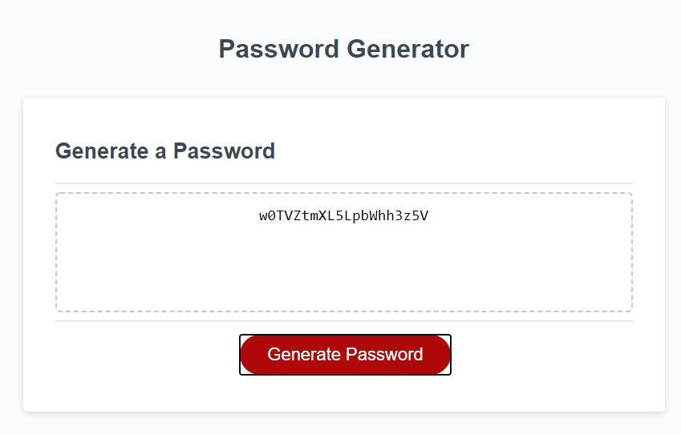

# Password Generator (Module 3: JavaScript)

## Description 

This site was designed to help me understand JavaScript and it's many uses in web interactivity. During this challenge I was tasked with creating the JavaScript for a password generator.

## Built With
* HTML
* CSS
* JavaScript

## Site Location

[Password Generator](https://russtracy.github.io/Password-Generator/)

## Contribution
Made by [Russ Tracy]

## Site Image

